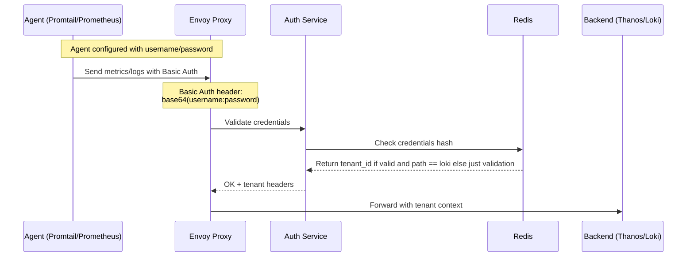

# dynamic-auth

```markdown
# Project Name

## Description

This project is a proof of concept for authentication and authorization.

## Architecture

The following diagram illustrates the sequence of interactions between different components:



## Usage

To use this project, follow these steps:

1. Clone the repository.
2. Install the required dependencies.
3. Configure the Agent with the appropriate username and password.
4. Start the Envoy Proxy.
5. Start the Auth Service.
6. Start the Redis server.
7. Start the Backend.
8. Send metrics/logs to the Agent with Basic Auth headers.
9. The Auth Service will validate the credentials and return the tenant headers.
10. The Envoy Proxy will forward the request to the Backend with the tenant context.

## License

This project is licensed under the MIT License. See the [LICENSE](./LICENSE) file for more information.
```