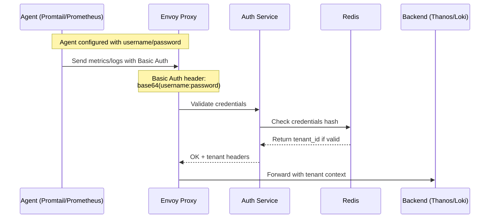

# dynamic-auth

```mermaid
sequenceDiagram
    participant A as Agent (Promtail/Prometheus)
    participant E as Envoy Proxy
    participant AS as Auth Service
    participant R as Redis
    participant B as Backend (Thanos/Loki)

    Note over A,E: Agent configured with username/password
    A->>E: Send metrics/logs with Basic Auth
    Note over E: Basic Auth header:<br/>base64(username:password)
    E->>AS: Validate credentials
    AS->>R: Check credentials hash
    R-->>AS: Return tenant_id if valid
    AS-->>E: OK + tenant headers
    E->>B: Forward with tenant context
```